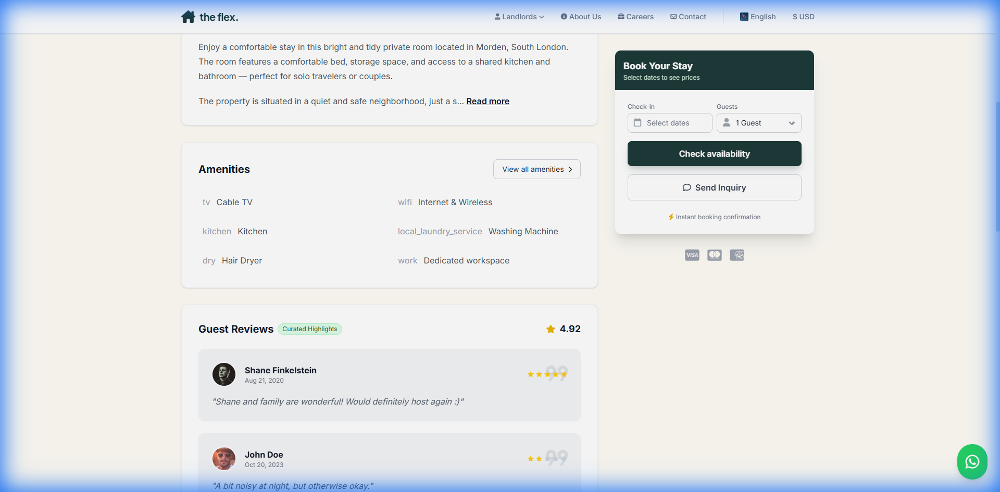

# Flex Living Reviews Dashboard - Project Documentation

## 1. Local Setup Instructions
To run the project locally, ensuring both the React frontend and the Express backend are active:

1.  **Install Dependencies**:
    ```bash
    npm install
    ```
2.  **Start the Application**:
    ```bash
    npm run dev:all
    ```
    - This command uses `concurrently` to run both the Vite development server and the Node.js API server.
    - **Frontend**: Access at `http://localhost:3000`
    - **Backend API**: Running on `http://localhost:3001`

### Environment Variables & Security
Although this MVP uses mock data, security is a priority. I use `.env` files to manage configuration.

- **`.env` (Server-Side)**: Stores sensitive credentials consumed only by the Express backend.
    ```bash
    HOSTAWAY_ACCOUNT_ID=61148
    HOSTAWAY_API_KEY=f943...
    ```
- **Security Note**: By routing requests through the Express backend (`/api/reviews/hostaway`), these keys remain server-side and are never exposed to the client browser, preventing API credential leakage.

## 2. Technology Stack & Strategic Rationale

### Frontend
- **React & Vite**: Chosen for **speed and ecosystem**. React's component-based architecture ensures the dashboard is modular and easy to extend, while Vite provides near-instant HMR (Hot Module Replacement) for a rapid development cycle.
- **TypeScript**: Implemented for **scalability and reliability**. Strict typing prevents entire classes of runtime errors, which is critical when handling complex nested data structures like reviews and analytics.
- **TailwindCSS**: Selected for **rapid UI iteration**. The utility-first approach ensures design consistency (spacing, colors) without maintaining bloated CSS files, allowing me to replicate the premium Flex Living aesthetic quickly.

### Backend
- **Node.js & Express**: Chosen for **unified architecture**. Using JavaScript across the full stack reduces context switching and allows for sharing types/validation logic if needed. It also simplifies deployment into a single container.

### State Management
- **React Context API**: Used to create a **single source of truth** for review data. This ensures that when a manager filters reviews, the analytics charts update instantly in sync, providing a seamless "Command Center" experience without the overhead of Redux.

## 3. Key Design & Logic Decisions

### Architecture: Unified Server
I adopted a "Unified" architecture to simplify development and future deployment.
- **Single Entry Point**: The `dev:all` script manages the complete stack.
- **Production Ready**: The Express server is structured to easily serve the React static build files in a production environment, requiring only a single deployment target (e.g., Render, Heroku).

### State Management Strategy
A global `ReviewsContext` was implemented to centralize data management:
- **Single Source of Truth**: Reviews are fetched once from the API and shared across the Dashboard and Property Details pages.
- **Dynamic Filtering**: The Dashboard's filter state (Property, Channel, Rating) is managed globally. This ensures that the filtering logic is consistent across the mock analytics charts and the reviews list.
- **Publishing Logic**: The "Publish" toggle modifies the in-memory state. Changes are immediately reflected on the Public Property Page (`PropertyDetails.tsx`), which filters to show only `isPublished: true`.

### UI/UX Decisions
- **Dashboard**: Designed with a "Command Center" feel—high-level metrics at the top, visual trends in the middle, and detailed management at the bottom.
- **Property Page**: Replicates the "Flex Living" brand (fonts, colors, layout) to ensure the reviews section feels native to the existing site.

## 4. API Behaviors
**Endpoint**: `GET /api/reviews/hostaway`
**Source**: `server/index.js`
- **Behavior**:
    - Returns a mocked list of reviews based on the provided JSON requirements.
    - Simulates a 500ms network delay to mimic real-world fetching.
- **Normalization**: The backend (`server/index.js`) handles all data transformation. It converts the Hostaway-specific format (1-10 categorical ratings, ISO dates) into the application's standard `Review` interface (1-5 star ratings, formatted dates, generated tags).
- **Response Format**:
  ```json
  {
    "status": "success",
    "result": [
       // Array of normalized Review objects ready for frontend display
       { "id": "...", "rating": 4.5, "tags": [], ... }
    ]
  }
  ```

## 5. Google Reviews Integration Findings
**Objective**: Explore integrating Google Reviews via Places API.

### Feasibility
Integration is **feasible** but requires a Google Cloud Project with the **Places API (New)** enabled and a valid API Key.

### Implementation Strategy for Future
1.  **Backend Proxy**: Start a server-side route (e.g., `GET /api/reviews/google/:placeId`) to call the Google API. This protects the API Key from being exposed in the client.
2.  **Google Places API Call**:
    - Use Field Masking: `fields=reviews,rating,userRatingCount` to minimize data usage.
    - Endpoint: `https://places.googleapis.com/v1/places/{PLACE_ID}`
3.  **Data Normalization Strategy**:
    - Google returns a 1-5 integer rating.
    - Mapping: Map Google's author_name to our schema's guestName and relative_time_description to date.
4.  **API Constraints**: The standard API returns only the 5 most helpful reviews.
    - Solution: For full history, we would need to implement a "Sync Job" (Cron) that stores reviews in a dedicated database (Postgres/MongoDB) rather than fetching live on every page load.

### Current Status
Mock implementation focused on the Hostaway integration as the primary data source, per the project scope.

## 6. Visuals
**Public Property Page - Reviews Section**
This screenshot demonstrates the "Review Display Page" implementation. It confirms that only reviews marked as "Published" by the manager are visible to guests, maintaining the provided Flex Living design aesthetic.


